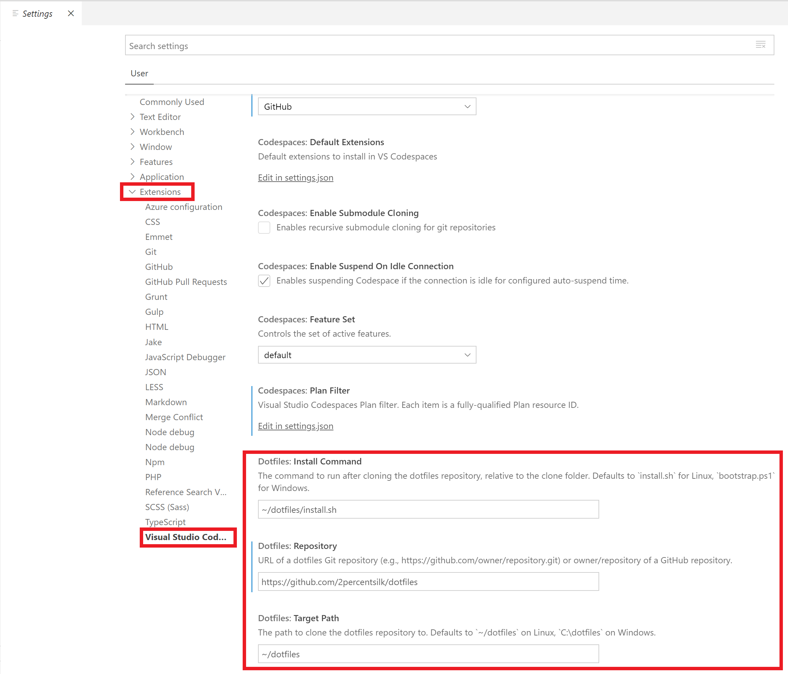
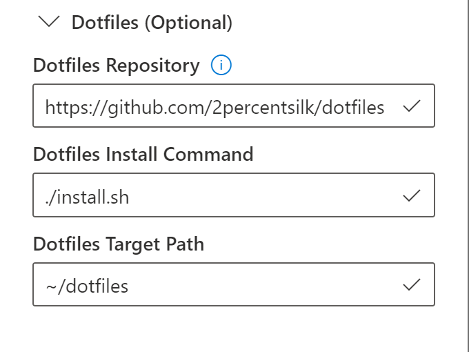

# Personalize Visual Studio Codespaces with dotfiles

Visual Studio Codespaces's [environments](../overview/what-is-vsonline.md#environments) are fully personalizable on a per user basis. This is accomplished by referencing a "dotfiles repo" at environment creation time.

- [Enable personalization settings sync in Visual Studio Code](#enable-personalization-settings-sync-in-visual-studio-code).
- [Configure a dotfile repo in the portal](#configure-a-dotfile-repo-in-the-portal).

Dotfiles are files whose filename begins with a dot (`.`). They typically contain configuration information for an application. They are used to control the way terminals, editors, source control, and other tools behave. Examples of dotfiles include `.bashrc`, `.gitignore`, and `.editorconfig`.

Developers often store dotfiles in a GitHub repository so they can easily synchronize them between development environments. For more information, see [GitHub Dotfiles](https://dotfiles.github.io/) on GitHub.io.

## Configure a dotfile repo in Visual Studio Code

To configure a dotfiles repo in Visual Studio Code:
Press **F1** and select the **Preferences: Open Setting (UI)** command in the [Command Palette](https://code.visualstudio.com/docs/getstarted/userinterface#_command-palette). In the **Settings** tab that opens, select the **Extensions** node in the navigation tree, followed by **Visual Studio Codespaces**. 

## Configure a dotfile repo in the portal

You can also configure dotfiles using the [Visual Studio Codespaces portal](https://online.visualstudio.com). Press the **Create Codespace** button and expand the **Dotfiles (optional)** settings.

In both experiences, there are three options that can be configured:

1. **Dotfiles Repository**: The URL of the Git repository containing your dotfiles. (*Required to personalize an environment, optional otherwise*)
2. **Dotfiles Target Path**: The path where the dotfiles repo will be cloned. Defaults to `~/dotfiles` on Linux, `C:\dotfiles` on Windows. (*Optional*)

3. **Dotfiles Install Command**: The command to run after cloning the dotfiles repository. The install command should be relative to the repository root folder.
By default, Codespaces scans the dotfiles repository and runs one of the following files. 

    On Linux-based codespaces:
    - `install.sh`
    - `install`
    - `bootstrap.sh`
    - `bootstrap`
    - `setup.sh`
    - `setup`
    
    On Windows-based codespaces:
    - `bootstrap.ps1`
    - `bootstrap.bat`

If none of these files are found, any files and folders starting with `.` are symlinked to the home (`~` or `$HOME` on Linux, `%HOMEPATH%` on Windows) directory. In addition, a couple of files are picked up automatically by convention for sourcing.

On Linux-based codespaces:
  - `zshrc` for zsh shell
  - `.bashrc` and `.bashprofile` for Bash and other shell

On Windows-based codespaces:
  - `profile.ps1` for PowerShell, this is not actually sourced as on Linux, but rather copied to `%USERPROFILE%\Documents\WindowsPowerShell\profile.ps1`

Please note that this last part only happens when you did not specify any install command and none of the pre-configured install scripts listed above are found.

Once the **Dotfiles Repository** is configured in VS Code, any environments created going forward will use the personalized settings.

## Enable personalization settings sync in Visual Studio Code

> [!NOTE]
> Settings Sync is currently in Preview and is only available in Visual Studio Code Insiders.

[Settings Sync](https://code.visualstudio.com/docs/editor/settings-sync) allows you to sync a variety of settings, such as theme, keyboard shortcuts, extensions, and more across your various Visual Studio Code instances to give you tooling consistency whether you're working from a local Visual Studio Code instance or the browser-based editor.

To use settings sync, ensure you're connecting to your codespace from within Visual Studio Code Insiders or enable Insiders for the browser based editor:

- Navigate to the **Settings** pane from the user account card.

  

- Toggle the **Insiders channel** option to on.

  

Once you're connected to the codespace:

- Click the **Manage** gear menu at the bottom of the **Activity Bar**.
- Enable the **Turn On Preferences Sync..** option.

For more information and troubleshooting Settings Sync, check out the [Visual Studio Code documentation](https://code.visualstudio.com/docs/editor/settings-sync).
